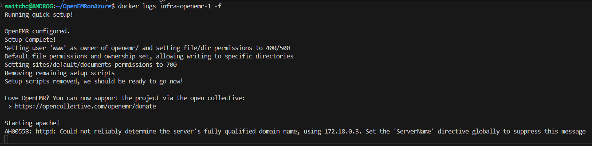
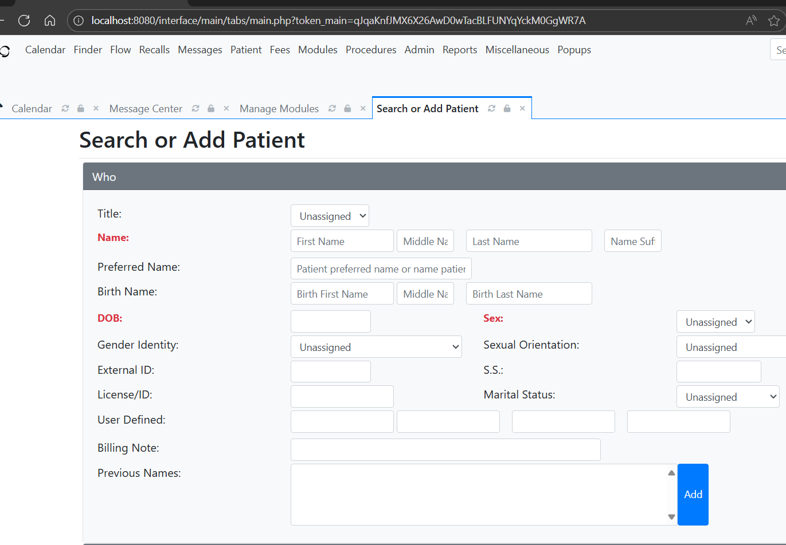

# OpenEMRonAzure

## Overview
Deploy a production-ready OpenEMR stack on Microsoft Azure using containerization, infrastructure as code, and secure defaults.

## Architecture (tentative)
- Azure Resource Group
- Azure Container Apps or AKS (pluggable)
- Azure Database for MySQL (Flexible Server)
- Azure Storage (File Share for documents, Blob for backups)
- Azure Key Vault (secrets, certificates)
- Azure Application Gateway or Front Door (TLS + WAF)
- Azure Monitor (logs, metrics, alerts)
- Optional: Entra ID for SSO

## Features (tentative)
- IaC-first (Bicep)
- Automated SSL/TLS
- Minimal/zero downtime rolling updates
- Daily encrypted backups
- Horizontal scale of web tier
- Least-privilege secrets flow

## Dev Setup

### Prerequisites
- Azure subscription + Owner or sufficient RBAC
- Azure CLI
- Docker + Compose (local dev)
- Git CLI

### Local dev with Docker

- Clone the project repo.

    ```sh
    git clone https://github.com/dkirby-ms/
    ```

- Make a copy of the .env.example file. Make changes to the default values if desired by opening the new file and editing it.

    ```sh
    cp ./infra/.env.example ./infra/.env
    ```

- Navigate to the [./infra](infra) folder and run docker compose up.

    ```sh
    cd ./infra
    docker compose up -d
    ```
- Confirm the OpenEMR container is up and running by checking the logs.

    ```sh
    docker logs infra-openemr-1
    ```

    

- Open a browser and navigate to [http://localhost:8080](http://localhost:8080)

    

- Use docker compose down to tear down (with -v to remove volumes).

    ```sh
    docker compose down -v
    ```
- Bicep

## Synthetic Patient Data Generation (Synthea -> OpenEMR PoC)

This repository includes an initial proof-of-concept pipeline to generate synthetic patients using Synthea and load a minimal subset of attributes into a simplified `patient_data` table hosted on Azure Database for MySQL. Raw Synthea CSV exports can be uploaded to Azure Blob Storage for traceability.

### Azure Resources (data generation subset)
- Azure Container Registry (stores the job image)
- Azure Storage Account + Blob Container (raw CSV retention)
- Azure Database for MySQL Flexible Server (development sizing)
- Azure Container Instance (ephemeral execution of generation + ETL)

### Security Notes
- ACR admin user enabled purely for demo; disable and use managed identity / tokens in production.
- MySQL public access + permissive firewall placeholder; prefer private networking + restricted IPs.
- ETL creates a minimal table (NOT full OpenEMR schema). Extend before integrating with a real OpenEMR deployment.
- Blob upload requires a storage connection string env var until managed identity is added.

### Workflow Overview
1. Deploy infra (Bicep) – sets container group with environment variables.
2. Build & push the Synthea job image to ACR.
3. Restart the container group to execute job (restart policy Never).
4. Inspect logs; verify data in MySQL.

### Quick Start
```bash
# 1. Deploy infra (random MySQL password auto-generated)
./synthetic-data/scripts/deploy_infra.sh my-openemr-rg eastus demoemr

# 2. Build & push image
./synthetic-data/scripts/build_push_image.sh my-openemr-rg synthea-job v1

# 3. Run job (restart container group)
./synthetic-data/scripts/run_job.sh my-openemr-rg

# 4. Check MySQL server info
az mysql flexible-server list -g my-openemr-rg -o table

# 5. Connect & verify (example)
mysql -h <server>.mysql.database.azure.com -u openemradmin@<server> -p openemr -e "SELECT COUNT(*) FROM patient_data;"
```

### Repository Additions
```
synthetic-data/
	infra/             Bicep template (data generation subset)
	container/         Docker context for Synthea + ETL
	scripts/           Deployment helper scripts
```

### Local Run (no Azure)
```bash
docker build -t synthea-local ./synthetic-data/container
docker run --rm -e PATIENT_COUNT=25 synthea-local
```

### Future Improvements
- Managed identity for ACR + Blob
- Key Vault secret management
- Expand ETL to full OpenEMR schema
- Scheduled job (Container Apps Job or Logic App)
- Integration tests / data validation

### Disclaimer
Synthea produces synthetic data only. This PoC is not production-hardened. Do not mix with real PHI until full security controls and schema mappings are implemented.
